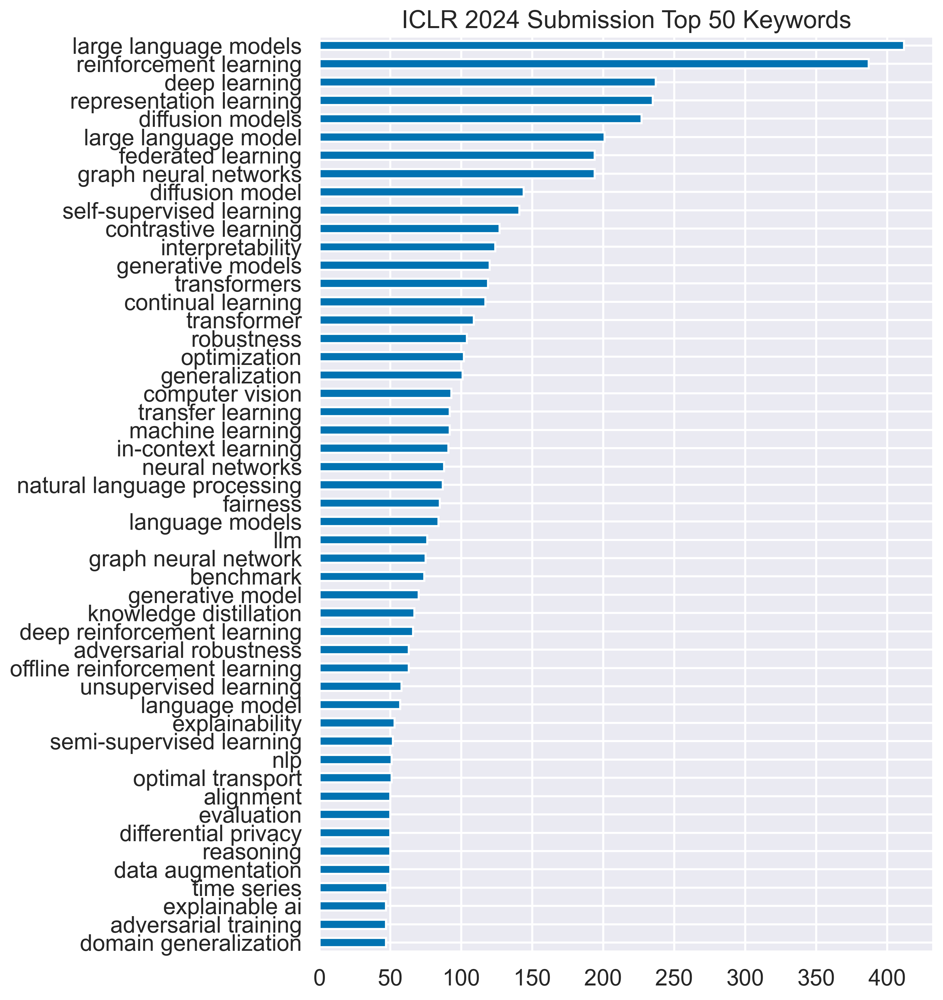
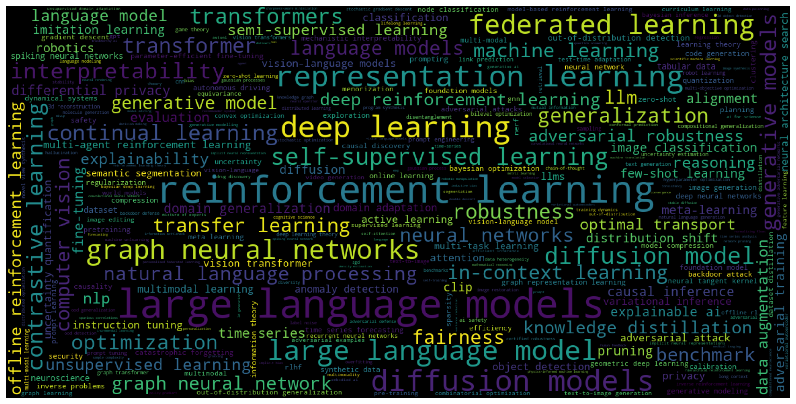

# ICLR 2024 Paper Submission Analysis

    

- Use `craw_and_plot.ipyb`.

+ **Keywords Frequency**
The top 50 common keywords and their frequency:

    

+ **Keywords Cloud**

    

## Acknowledgment
Based on the following two repositories:
1. https://github.com/fedebotu/ICLR2023-OpenReviewData

